# PraecisAI: tech flows for pitching

Copy-paste Mermaid for decks, docs and investor/customer conversations. Every
diagram matches what the code actually does. Renders in GitHub, Notion,
Obsidian, mermaid.live and most slide tools.

Contents: [architecture](#1-system-architecture--tech-stack) ·
[product flow](#2-end-to-end-product-flow) ·
[AI call](#3-ai-call-lifecycle) ·
[WhatsApp](#4-whatsapp-statement-flow-with-retry-ladder) ·
[guardrails](#5-contact-guardrails-the-can-we-call-this-party-gate) ·
[segments](#6-segment-state-machine) ·
[PDC](#7-pdc-cheque-lifecycle) ·
[queues](#8-queue-and-scheduler-topology) ·
[billing](#9-billing-and-entitlement-flow) ·
[data model](#10-data-model) ·
[what we tackle](#11-what-we-tackle-and-how)

---

## 1. System architecture / tech stack

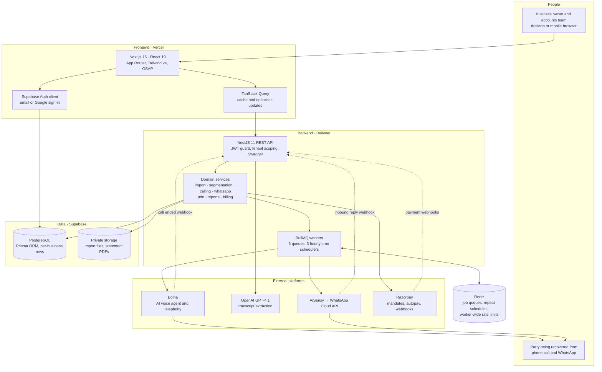

---

## 2. End-to-end product flow

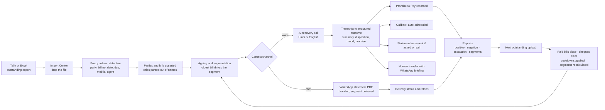

---

## 3. AI call lifecycle

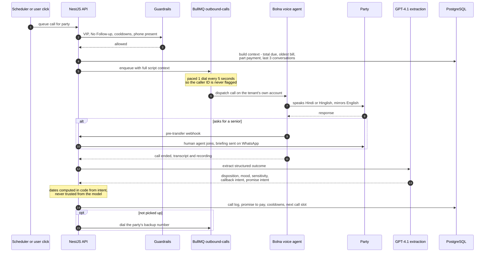

---

## 4. WhatsApp statement flow with retry ladder

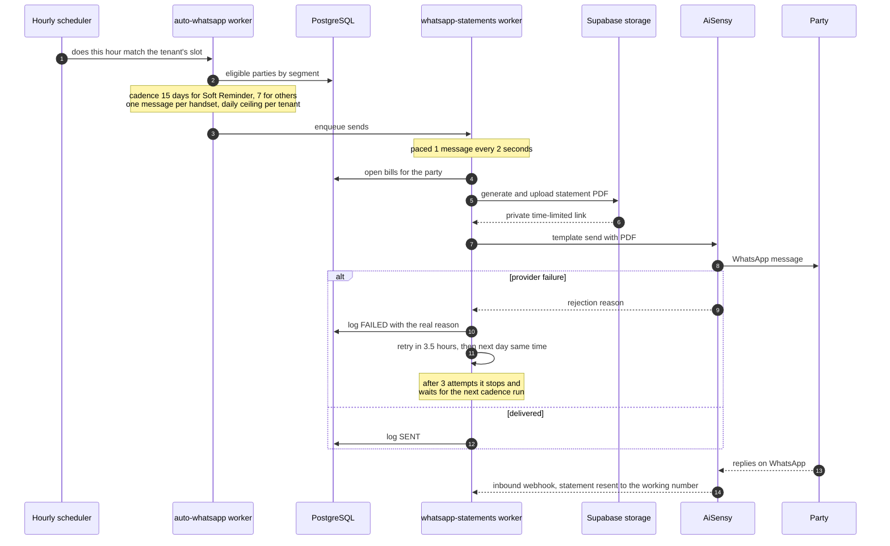

---

## 5. Contact guardrails: the "can we call this party" gate

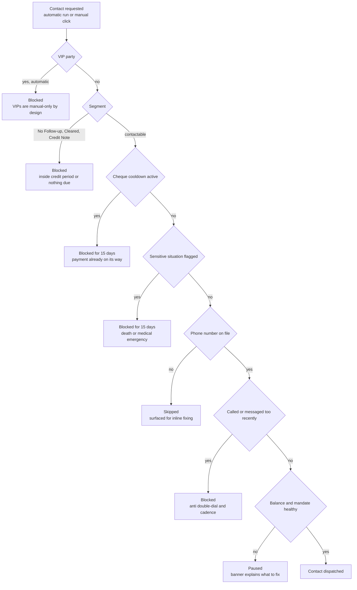

---

## 6. Segment state machine

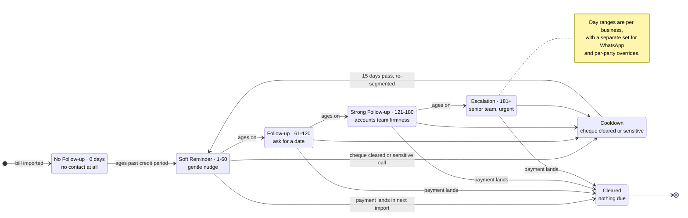

---

## 7. PDC cheque lifecycle

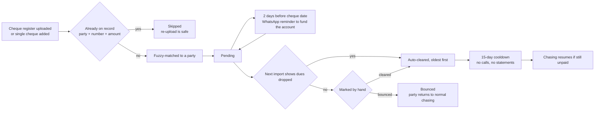

---

## 8. Queue and scheduler topology

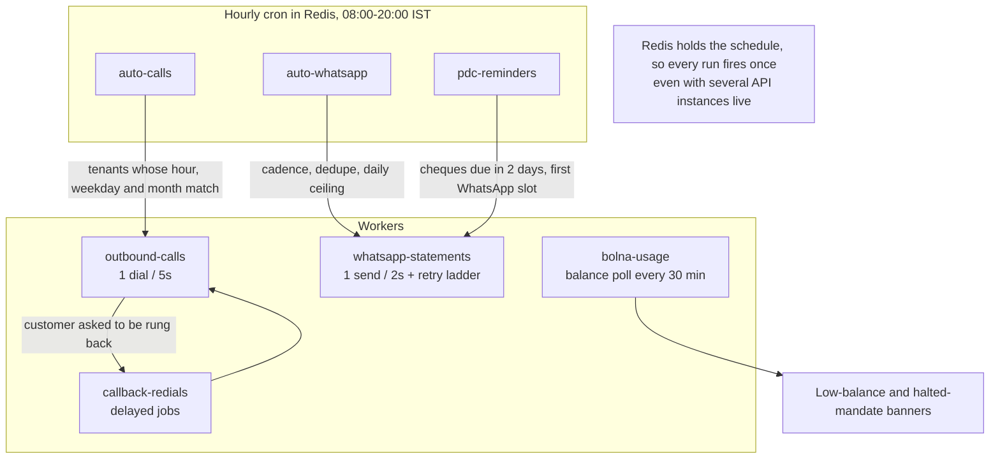

---

## 9. Billing and entitlement flow

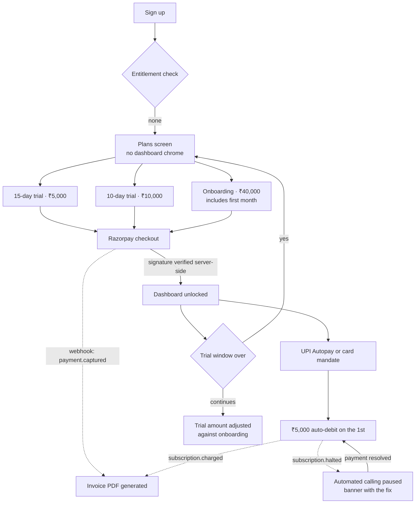

---

## 10. Data model

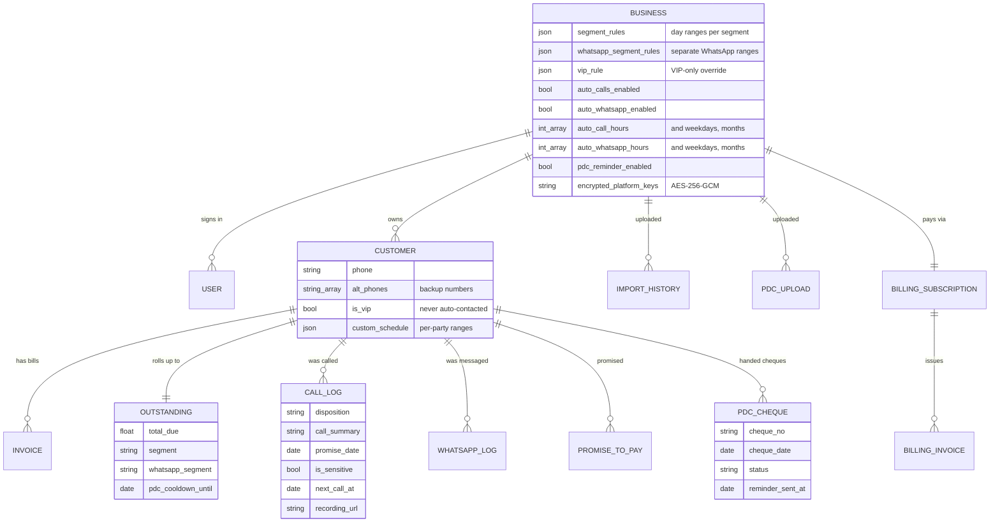

---

## 11. What we tackle, and how

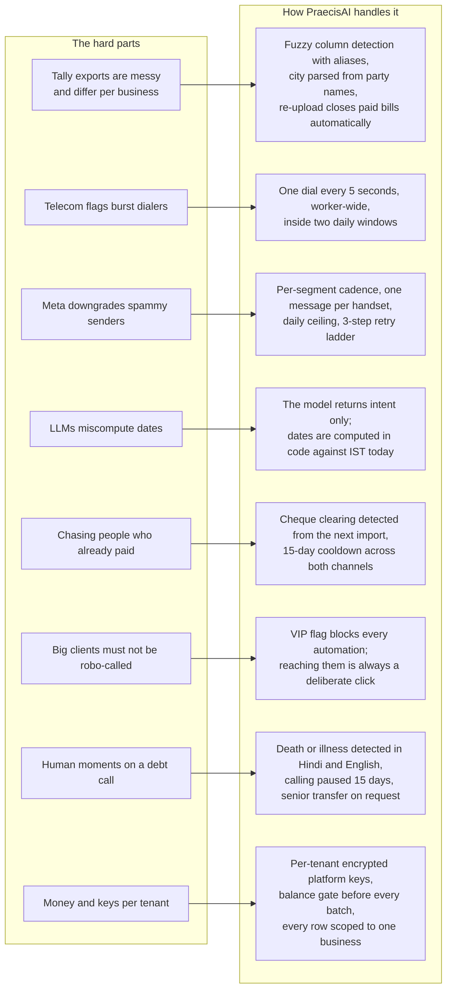

### The same points in one line each

| Problem | Our approach |
| --- | --- |
| Every business exports a different Excel | Column aliases plus fuzzy matching: no mapping screen, clear errors when a required column is genuinely missing |
| Imports are cumulative and get re-uploaded | Each upload is the new truth: bills added, dues updated, missing bills marked paid, duplicate cheques skipped |
| Indian operators flag dense dialing | One call every 5 seconds worker-wide, inside the tenant's own two daily windows, on the tenant's own caller ID |
| WhatsApp quality ratings are fragile | 15-day and 7-day cadences, one message per physical handset, a daily ceiling, and a retry ladder that gives up rather than hammering |
| LLM date arithmetic is unreliable | The model extracts intent, code computes the calendar date from IST today; promises and callbacks are deterministic |
| Recovery calls hit real human situations | Death and illness are detected in Hindi and English phrasing and pause that party for 15 days; a senior transfer sends the human a WhatsApp briefing first |
| Nobody should chase settled money | Cleared cheques are detected from the next import and trigger a 15-day cooldown on both channels |
| Key accounts need human handling | VIP parties are excluded from every automated path; contacting them is always an explicit action |
| Multi-tenant money and credentials | Platform keys are AES-256-GCM encrypted per tenant, never returned to the browser; a balance and mandate gate runs before every batch |
| Long-running imports and bulk sends | Everything heavy runs as a background job in Redis-backed queues, so no request times out and a redeploy resumes cleanly |
